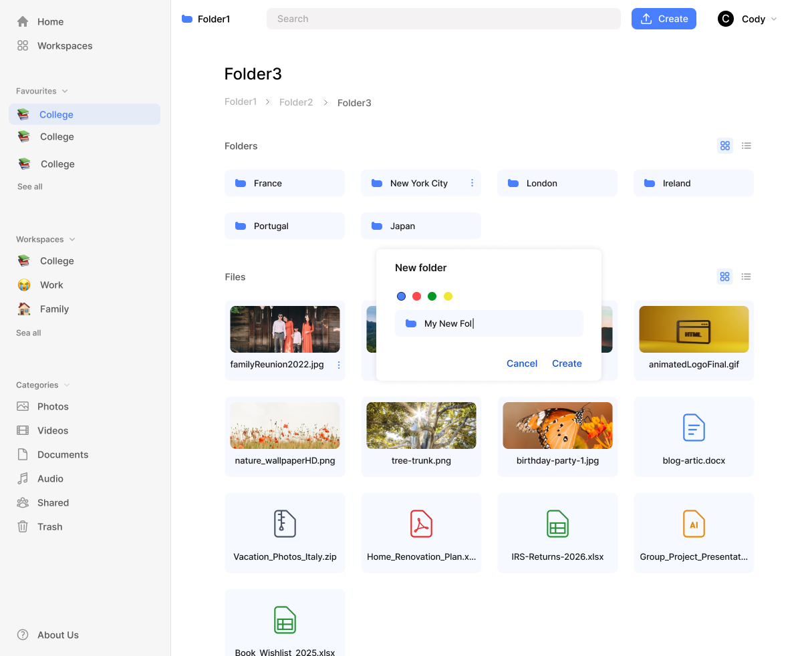
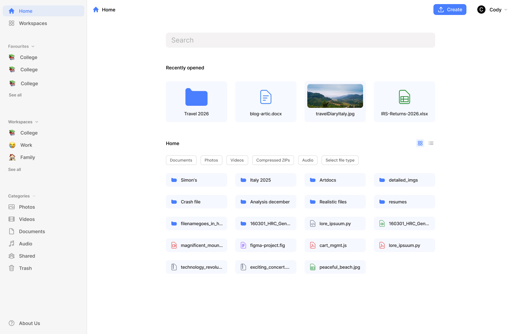
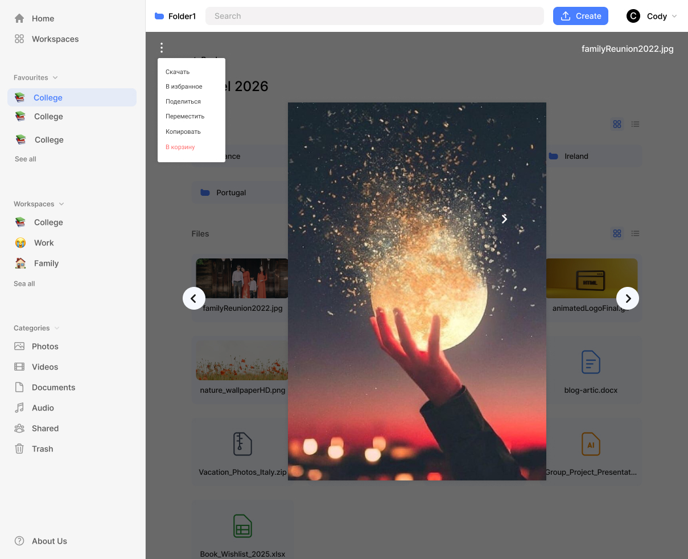
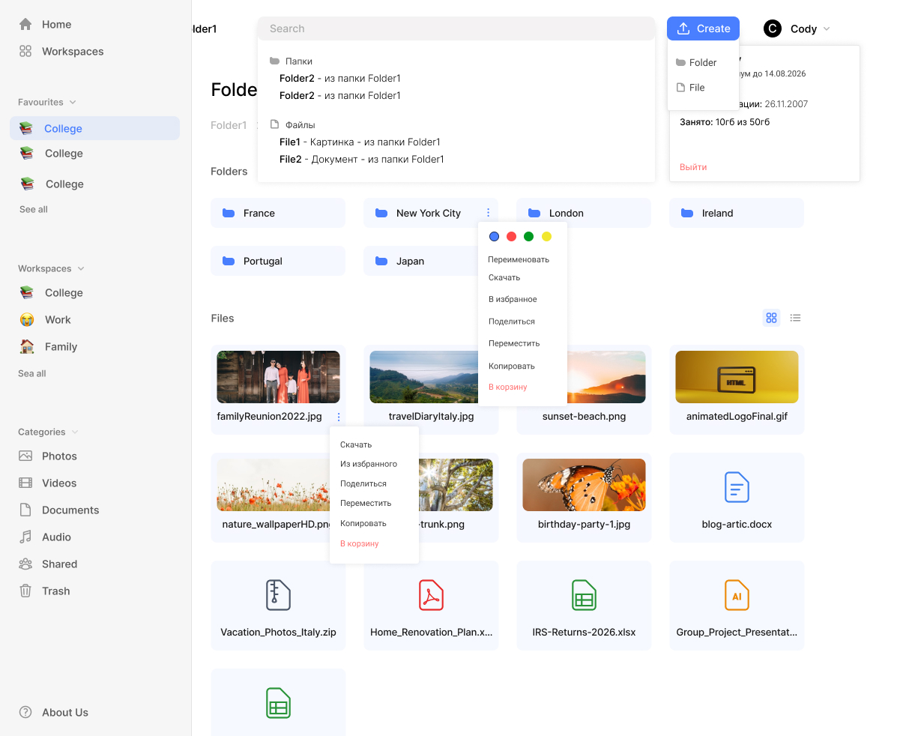
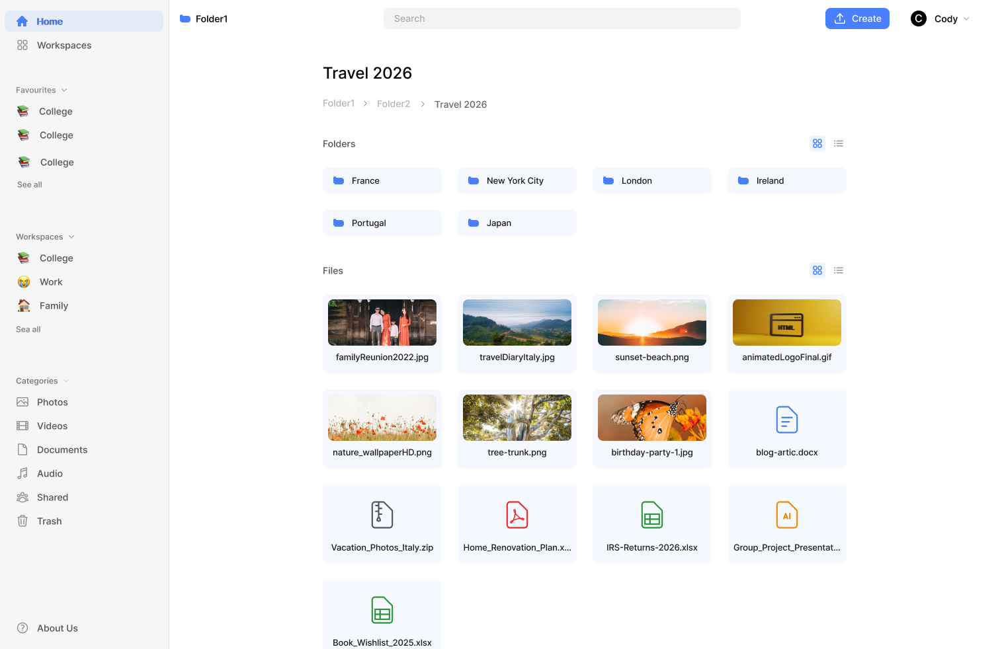
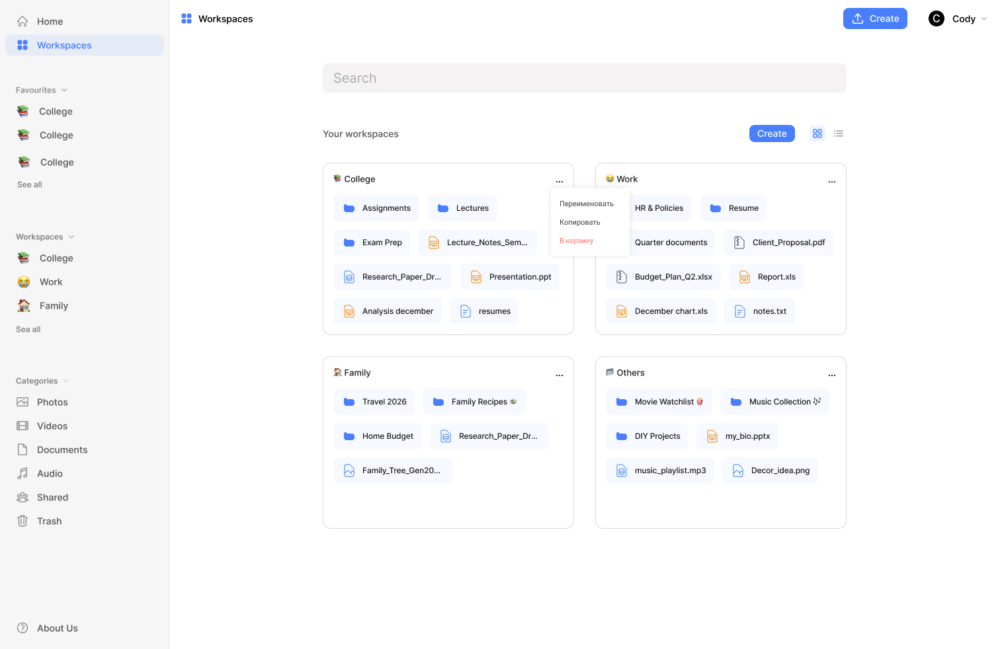

# 🌥️ Cloudgram

**Cloudgram** — это frontend-часть облачного файлового хранилища, ориентированного на пользователей Telegram. Приложение предоставляет удобный интерфейс для хранения, просмотра, поиска и управления файлами, используя современный UI и технологический стек.

> 🔗 Cloudgram работает в связке с backend-API: [Swagger-Документация](https://api.cloudgram-dev.ru/docs/swagger)

---

## 🖼️ Превью интерфейса








---

## 🚀 Функциональность

<!-- -   🌙 Переключение темы (светлая/тёмная) -->

-   🔐 Авторизация через Telegram
-   🗂 Просмотр и управление файлами и папками
-   🔎 Поиск файлов
-   📁 Отдельные страницы для различных типов данных (фото, документы, видео и т.д.)
-   ♻️ Корзина, избранное, раздел "Общие"
-   🧭 Адаптивный интерфейс, удобная навигация
-   ⚙️ Хранилище пользовательских настроек

---

## 🛠️ Технологии

-   **React 19 + TypeScript**
-   **Redux Toolkit** и RTK Query
-   **React Hook Form + Zod** для валидации форм
-   **React Router v7**
-   **Chakra UI** для базовой стилизации и темизации
-   **SASS Modules** для модульных стилей
-   **Vite** как сборщик
-   **Docker (в планах)**

---

## 📂 Архитектура проекта

Проект построен по **FSD(фиче-ориентированной архитектуре)** с разделением на:

-   `entities/` — бизнес-сущности (user, file, folder)
-   `features/` — пользовательские функции (auth, file explorer, search)
-   `widgets/` — крупные композиционные блоки
-   `pages/` — маршрутизируемые страницы
-   `shared/` — переиспользуемые утилиты, API, хелперы, компоненты

---

## ⚙️ Установка и запуск

### 1. Клонирование репозитория

```bash
git clone https://github.com/Cloudgram/cloudgram-webapp.git
cd cloudgram-webapp
```

### 2. Установка зависимостей

```
npm install
```

### 3. Запуск в режиме разработки

```
npm run dev
```

### 4. Сборка проекта

```
npm run build
```

### 5. Предпросмотр production-версии

```
npm run preview
```
